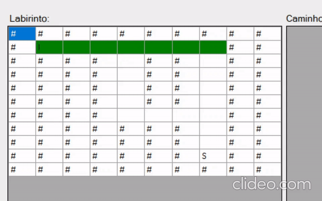

# maze-backtracking

This is a C# algorithm to solve mazes contained in text files. 

It uses backtracking and finds all possible paths, so a simple maze can have a lots of different solutions.

The program uses Windows Forms, so the maze and the paths are displayed on the screen.

### How to use

1. Clone this repository

    $ git clone https://github.com/oGabrielArruda/maze-backtracking.git
   
2. Open the program in Visual Studio or open directly the .exe. ( bin > debug > .exe)
3. Click in the first button and select a .txt file, containing a maze. 
4. There are some text files to use as example in the project folder.
5. Finally, click in the second button to start solving the maze. This may take a while, depending on the maze.

### About

- This project was made for the Data Structures II class.
- Technical High School of Campinas, 2020.
- The code is in portuguese.
